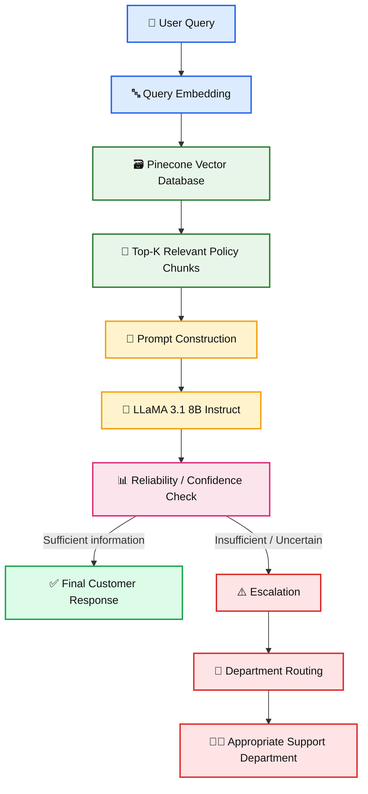
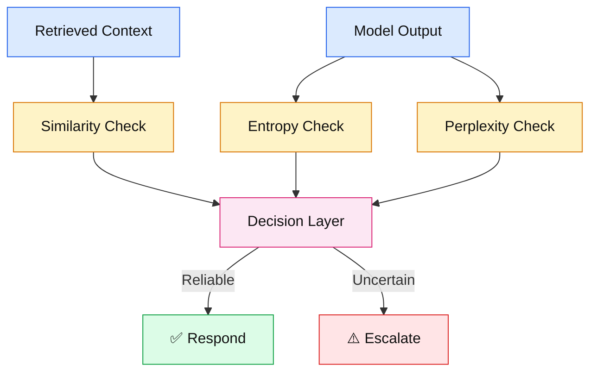
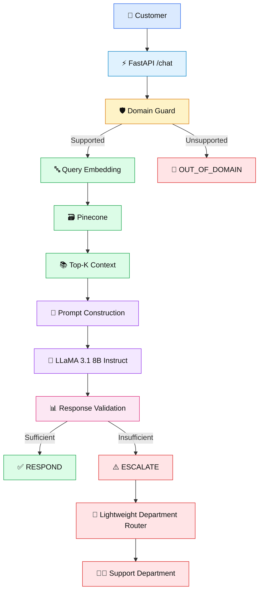

# 🤖 Retrieval-Augmented Customer Support Chatbot with Intelligent Escalation

<p align="center">

**An AI-powered customer support system using Retrieval-Augmented Generation (RAG), LLaMA 3.1 8B Instruct, Pinecone, uncertainty-aware decision making, conversation memory, and intelligent escalation.**

</p>

<p align="center">


</p>

---

## 🚀 Live Deployment

The chatbot is deployed on Render and is publicly accessible.

### 🌐 Live Application

**Live URL:**  
https://amazon-customer-support-chatbot.onrender.com

### 📚 API Documentation

The project provides interactive FastAPI Swagger documentation.

**Swagger UI:**  
https://amazon-customer-support-chatbot.onrender.com/docs

### ❤️ Health Check

You can check whether the deployed API is running:

**Health Endpoint:**  
https://amazon-customer-support-chatbot.onrender.com/health

The endpoint should return:

```json
{
  "status": "healthy"
}

## 📌 Project Overview

Customer support systems often need to answer questions using company policies, product information, refund rules, delivery policies, return procedures, and payment information.

A normal chatbot may generate an answer even when it does not have enough information. This can lead to incorrect or hallucinated responses.

This project was designed to solve that problem.

Instead of directly asking an LLM to answer every question, the system first retrieves relevant information from a knowledge base and then uses that information to generate the response.

If the system is not confident that it has enough information, the query can be escalated instead of blindly generating an answer.

The overall idea is:

> **Retrieve relevant knowledge → Generate a grounded answer → Check reliability → Respond or Escalate**

---

# 🎯 What Problem Are We Solving?

Imagine a customer asks:

> "Where is my refund?"

A traditional LLM may answer based on its general knowledge.

But a customer-support system should ideally answer using the organization's actual policies.

For example:

> "You can check your refund status from the Your Orders section..."

The answer should come from the available support-policy knowledge rather than from the model's general assumptions.

The system therefore uses **Retrieval-Augmented Generation (RAG)**.

---

# 💡 Main Idea

The chatbot combines several components:

- 🔎 Semantic search
- 📚 Retrieval-Augmented Generation
- 🧠 LLaMA 3.1 8B Instruct
- 🗃️ Pinecone vector database
- 💬 Conversation memory
- 📊 Retrieval confidence checking
- ⚠️ Uncertainty-aware escalation
- 🧭 Department routing
- 🚀 FastAPI backend
- ☁️ Render deployment

---

# 🏗️ High-Level Architecture

The complete conceptual architecture is:



---

# 🧩 The System in Simple Words

The system can be understood as the following sequence:

| Stage | What happens |
|---|---|
| 👤 User Query | Customer asks a question |
| 🔤 Embedding | Query is converted into a numerical representation |
| 🔎 Retrieval | Relevant policy information is searched |
| 📚 Context | Top relevant chunks are collected |
| 🧩 Prompt | Query + retrieved context + conversation history are combined |
| 🦙 LLaMA | LLaMA generates the response |
| 📊 Confidence | System checks whether the response is sufficiently supported |
| ✅ Respond | If reliable, answer the customer |
| ⚠️ Escalate | If information is insufficient, escalate |
| 🧭 Routing | Identify the appropriate support department |

---

# 📚 What is RAG?

RAG stands for:

> **Retrieval-Augmented Generation**

Instead of depending only on the knowledge stored inside the LLM, RAG gives the LLM relevant external information before generating an answer.

The basic idea is:

```text
User Question
      ↓
Search Knowledge Base
      ↓
Retrieve Relevant Information
      ↓
Give Information + Question to LLM
      ↓
Generate Grounded Answer
```

This helps the model answer using the available support information.

---

# 🔹 Why Did We Use RAG?

A customer-support chatbot needs domain-specific information.

For example:

- Refund policies
- Return policies
- Delivery information
- Payment information
- Order information
- Account support

An LLM by itself does not automatically know the latest or specific internal policy documents.

RAG allows us to connect the LLM with a searchable knowledge base.

---

# 📄 Knowledge Base Creation

The project starts with customer-support policy documents.

The document-processing pipeline is:

```text
Policy Documents
      ↓
Text Extraction
      ↓
Cleaning
      ↓
Chunking
      ↓
Embedding Generation
      ↓
Pinecone
```

Each document is divided into smaller chunks so that relevant information can be retrieved efficiently.

---

# 🧠 Embeddings

An embedding converts text into a numerical vector.

For example:

```text
"My refund has not arrived"
```

is converted into something like:

```text
[0.12, -0.43, 0.87, ...]
```

The exact values are not important by themselves.

What matters is that semantically similar sentences should have similar vector representations.

The project uses:

```text
sentence-transformers/all-MiniLM-L6-v2
```

for the 384-dimensional embedding representation.

---

# 🗃️ Pinecone Vector Database

The generated embeddings are stored in Pinecone.

Pinecone allows the system to perform semantic similarity search.

For example:

```text
User:
"Where is my refund?"

        ↓

Embedding

        ↓

Pinecone

        ↓

Relevant refund policy chunks
```

The retrieved chunks also contain metadata such as document/source information, page information, and chunk information.

---

# 🔎 Retrieval Process

When a customer asks a question:

1. Convert the query into an embedding.
2. Search Pinecone.
3. Calculate similarity with stored vectors.
4. Retrieve the most relevant chunks.
5. Pass those chunks to the LLM.

Conceptually:

```text
Query → Embedding → Similarity Search → Top-K Documents
```

Cosine similarity can be represented as:

```text
                    q · d
Similarity(q,d) = ---------
                   ||q|| ||d||
```

where:

- `q` = query embedding
- `d` = document embedding

Higher similarity means the retrieved document is more semantically related to the query.

---

# 🦙 Response Generation with LLaMA

After retrieving relevant information, the system constructs an augmented prompt.

Conceptually:

```text
System Instructions

Conversation History

Retrieved Information

User Query
```

This information is given to:

```text
LLaMA 3.1 8B Instruct
```

The model then generates the customer-facing response.

---

# 💬 Conversation Memory

Customer support conversations are usually multi-turn.

For example:

```text
User:
My refund has not arrived.

Assistant:
You can check the refund status...

User:
I already checked it.

Assistant:
...
```

The second question depends on the previous conversation.

Therefore, the system maintains previous user-assistant interactions as conversation history.

Conceptually:

```text
Conversation History

User 1 → Assistant 1
User 2 → Assistant 2
User 3 → Assistant 3
...
```

This history can then be included in the next prompt.

The implemented project uses a simple list-based memory approach rather than an advanced memory-compression system.

---

# ⚠️ Why Do We Need Confidence Checking?

One of the most important ideas in this project is:

> **The chatbot should not answer confidently when it does not have enough information.**

For example:

```text
User:
"What is the weather today?"
```

This is unrelated to the customer-support knowledge base.

The system should not ask LLaMA to invent an Amazon-support answer.

Instead, the query should be detected as outside the supported domain.

---

# 📊 Confidence and Uncertainty

The original project design explored multiple signals:

### 1. Retrieval Similarity

If the retrieved documents have very low similarity to the query, the system may not have enough relevant information.

Conceptually:

```text
Low Retrieval Similarity
        ↓
Weak Evidence
        ↓
Possible Escalation
```

---

### 2. Entropy

Entropy measures uncertainty in a probability distribution.

```text
H = - Σ pi log(pi)
```

Higher entropy indicates a more uncertain prediction.

Conceptually:

```text
Low Entropy
    ↓
More confident

High Entropy
    ↓
More uncertain
```

---

### 3. Perplexity

Perplexity measures how well the model predicts a sequence.

Conceptually:

```text
Low Perplexity
      ↓
More confident

High Perplexity
      ↓
More uncertain
```

---

# 🛡️ Combined Decision Concept

The research design combines multiple signals:



The documented research rule is:

```text
If retrieval confidence is insufficient
OR
model uncertainty is high

        ↓

Escalate
```

Otherwise:

```text
Respond
```

---

# 🚨 Intelligent Escalation

Escalation means that the chatbot does not try to answer every question automatically.

For example:

```text
Customer:
"I want to speak to a human agent about my refund."

                    ↓

Explicit human-support request

                    ↓

ESCALATE

                    ↓

REFUND Department
```

Another example:

```text
Customer:
"I did not receive my package."

                    ↓

Delivery-related problem

                    ↓

ESCALATE

                    ↓

DELIVERY Department
```

---

# 🧭 Department Routing

The original architecture included a BERT-based department routing classifier.

The intended departments include:

```text
REFUND
RETURN
ORDER
DELIVERY
PAYMENT
CONTACT SUPPORT
```

Example:

| Customer Query | Department |
|---|---|
| "My refund is still pending" | Refund |
| "I want to return this item" | Return |
| "Can I cancel my order?" | Order |
| "My package has not arrived" | Delivery |
| "My payment failed" | Payment |
| "I need customer support" | Contact Support |

---

# 🧪 Development Journey

This project was not built in one step.

The system evolved through multiple experiments.

The development journey was approximately:


---

# 🧪 Experiment 1 — Fine-Tuned Mistral 7B

Initially, a Mistral 7B model was explored for customer-support behavior.

The project used a customer-support dataset containing query-response examples.

However, the experiment showed an important limitation.

The model frequently produced responses that:

- Asked for reference numbers repeatedly
- Were overly generic
- Did not always provide actionable solutions
- Did not handle follow-up queries well

The underlying issue was related to the nature of the training data.

The dataset primarily contained single-turn query-response pairs and did not provide enough multi-turn problem-solving examples.

---

# 🔄 Why We Switched to LLaMA

Instead of continuing with the same fine-tuning approach, the project moved to:

```text
LLaMA 3.1 8B Instruct
```

The instruction-tuned model was used for response generation.

This allowed the system to focus more on:

```text
Retrieval
   +
Context
   +
Instructions
   +
Conversation History
   ↓
Response
```

The project report documents this transition as an important development step.

---

# 📊 Dataset

The project experimented with the **Bitext Customer Support Dataset**.

The dataset contains customer-support query-response examples designed around customer-service interactions.

It was useful for experimenting with:

- Customer-support language
- Intent patterns
- Common support queries
- Response generation
- Fine-tuning experiments

However, the dataset was not used as the final source of truth for factual policy answers.

Instead, the final system relies on retrieved policy information through the RAG pipeline.

This distinction is important:

```text
Dataset
   ↓
Training / Experimentation

Policy Documents
   ↓
Knowledge Base
   ↓
Pinecone
   ↓
Final RAG Retrieval
```

---

# 📚 Why Policy Documents Are Important

For a customer-support assistant, factual answers should come from the available support policies.

Therefore:

```text
Customer Question
        ↓
Relevant Policy
        ↓
Retrieved Context
        ↓
LLM
        ↓
Answer
```

This is different from simply training an LLM on question-answer pairs.

---

# 🧪 BERT Routing Experiment

A separate BERT-based model was explored for department routing.

The purpose was:

```text
Escalated Query
      ↓
BERT Classifier
      ↓
Department
```

Example:

```text
"My payment failed"
        ↓
PAYMENT
```

```text
"My refund is pending"
        ↓
REFUND
```

The BERT model and its local/ONNX versions were tested during development.

---

# ⚙️ Deployment Constraint

The original BERT routing model was relatively large for a small free deployment environment.

Therefore, the final Render deployment was simplified to use a lightweight routing approach instead of loading the large BERT model directly into the production service.

This is an important engineering decision:

```text
Research / Experiment
        ↓
BERT Routing
        ↓
Memory / Deployment Constraint
        ↓
Lightweight Production Routing
```

The BERT experiments are still preserved in:

```text
experiments/bert/
```

while the deployed application uses the lightweight production routing logic.

---

# 🚀 Production Application

The current production application is:

```text
app.py
```

It provides a FastAPI backend.

Main endpoints include:

```text
GET /
GET /health
POST /chat
```

---

# 🔌 API Flow

A simplified request looks like:

```text
POST /chat

        ↓

User Query

        ↓

Domain / Retrieval Check

        ↓

Pinecone Retrieval

        ↓

Context Construction

        ↓

LLaMA

        ↓

Decision

   ┌────┴────┐
   ↓         ↓
Respond   Escalate
             ↓
        Department
```

---

# 🧪 Example Query

### Normal query

```text
User:
Where is my refund?
```

The system retrieves relevant refund information and generates a grounded response.

Expected high-level result:

```text
RESPOND
```

---

### Human-support request

```text
User:
I want to speak to an agent about my refund.
```

Expected result:

```text
ESCALATED
Department: REFUND
```

---

### Out-of-domain query

```text
User:
What is the weather today?
```

Expected result:

```text
OUT_OF_DOMAIN
```

The system should not try to answer an unrelated question as an Amazon customer-support query.

---

# 🧱 Production Architecture

The current production application can be viewed as:



---

# 🧠 Production Decision Logic

The current production system performs several checks before returning an answer.

Conceptually:

```text
User Query
    ↓
Explicit Human Request?
    ↓
Domain / Retrieval Check
    ↓
Relevant Context?
    ↓
Generate Response
    ↓
Response Sufficient?
    ↓
YES → Respond

NO → Escalate
```

This prevents the system from treating every LLM output as automatically correct.

---

# 🛠️ Technologies Used

| Technology | Purpose |
|---|---|
| Python | Main programming language |
| FastAPI | Production API |
| Hugging Face | Model inference |
| LLaMA 3.1 8B Instruct | Response generation |
| all-MiniLM-L6-v2 | Text embeddings |
| Pinecone | Vector database |
| NumPy | Numerical operations |
| BERT | Department-routing experiment |
| Jupyter Notebook | Data processing and experimentation |
| Render | Production deployment |
| GitHub | Source-code management |

---

# 📁 Project Structure

```text
amazon-customer-support-chatbot/
│
├── app.py
├── requirements.txt
├── render.yaml
├── README.md
├── .gitignore
│
├── experiments/
│   ├── analysis/
│   │   └── retrieval_confidence_calibration.py
│   │
│   ├── bert/
│   │   ├── bert_routing_test.py
│   │   ├── convert_bert_direct.py
│   │   ├── convert_bert_onnx.py
│   │   ├── test_bert_hf.py
│   │   ├── test_bert_local.py
│   │   ├── test_bert_onnx.py
│   │   ├── test_bert_onnx_memory.py
│   │   └── bert_onnx/
│   │
│   └── huggingface/
│       ├── rag_llama_hf_test.py
│       ├── test_hf_embedding.py
│       └── test_llama_hf.py
│
├── notebooks/
│   ├── 01_data_preprocessing/
│   │   └── BiText_Data_Preprocessing.ipynb
│   │
│   ├── 02_rag_database/
│   │   ├── RAG_Database_Preparation (2).ipynb
│   │   └── Testing_Pinecone_connection (2).ipynb
│   │
│   └── 03_bert_routing/
│       ├── Training_BERT_Department_Routing (1).ipynb
│       └── Testing_BERT_Routing (1).ipynb
│
├── scripts/
│   └── pinecone_upload.py
│
├── src/
│   └── legacy/
│       ├── customer_support_pipeline.py
│       ├── customer_support_pipeline_v2.py
│       ├── customer_support_pipeline_v3.py
│       └── customer_support_pipeline_v4.py
│
└── tests/
    ├── answerability_test.py
    ├── context_relevance_test.py
    ├── decision_layer_test.py
    ├── domain_guard_test.py
    ├── grounding_test.py
    ├── ood_domain_guard_test.py
    ├── pinecone_retrieval_test.py
    ├── rag_confidence_test.py
    ├── rag_escalation_bert_test.py
    ├── real_query_pinecone_test.py
    ├── retrieval_guard_test.py
    ├── retrieval_quality_test.py
    ├── test_lightweight_router.py
    └── uncertainty_test.py
```

---

# 📂 Folder Explanation

## `app.py`

Current production application.

This is the file used by the deployed FastAPI service.

---

## `experiments/`

Contains experiments and alternative approaches explored during development.

These files are preserved for understanding how the project evolved.

### `experiments/bert/`

Contains:

- BERT testing
- Local BERT experiments
- ONNX conversion
- ONNX memory testing
- routing experiments

### `experiments/huggingface/`

Contains:

- LLaMA Hugging Face tests
- embedding tests
- RAG + LLaMA tests

### `experiments/analysis/`

Contains:

- retrieval confidence calibration experiments

---

# 📓 `notebooks/`

Contains the research and development notebooks.

### `01_data_preprocessing`

Responsible for preprocessing the customer-support data.

### `02_rag_database`

Contains:

- RAG database preparation
- Pinecone connection testing

### `03_bert_routing`

Contains:

- BERT department-routing training
- BERT routing testing

---

# 🧰 `scripts/`

Contains useful standalone scripts.

Current script:

```text
pinecone_upload.py
```

This script was used for preparing/uploading vector data to Pinecone.

---

# 🗃️ `src/legacy/`

Contains previous versions of the main pipeline.

```text
customer_support_pipeline.py
customer_support_pipeline_v2.py
customer_support_pipeline_v3.py
customer_support_pipeline_v4.py
```

These are **not the current production entry point**.

They are preserved because they show how the system evolved.

---

# 🧪 `tests/`

Contains testing files used during development.

The tests cover areas such as:

- Answerability
- Context relevance
- Domain guard
- Grounding
- Retrieval quality
- Retrieval guard
- Confidence
- Escalation
- Lightweight routing
- Uncertainty

---

# 🚫 Data Files Not Included in GitHub

Large/generated data is intentionally kept outside the GitHub repository.

Examples:

```text
data/processed/
data/embeddings/
data/raw/Policy.zip
experiments/bert/bert_onnx/
```

These files are either generated/intermediate artifacts or large model artifacts.

The production application does not need these local files because the deployed system uses Pinecone for retrieval.

---

# 🔐 Environment Variables

The application uses environment variables for secrets and configuration.

Required variables:

```text
PINECONE_API_KEY
PINECONE_INDEX_NAME
HF_TOKEN
```

Example:

```text
PINECONE_INDEX_NAME=amazon-policies
```

API keys and tokens should **never be committed to GitHub**.

---

# 💻 Local Setup

## 1. Clone the repository

```bash
git clone <YOUR_GITHUB_REPOSITORY_URL>
cd amazon-customer-support-chatbot
```

## 2. Create a virtual environment

Windows:

```powershell
python -m venv .venv
```

Activate:

```powershell
.venv\Scripts\activate
```

---

## 3. Install dependencies

```bash
pip install -r requirements.txt
```

---

## 4. Set environment variables

Windows PowerShell example:

```powershell
$env:PINECONE_API_KEY="YOUR_PINECONE_API_KEY"
$env:PINECONE_INDEX_NAME="amazon-policies"
$env:HF_TOKEN="YOUR_HUGGINGFACE_TOKEN"
```

Never commit these values to GitHub.

---

# ▶️ Run Locally

Start the FastAPI application:

```bash
uvicorn app:app --host 0.0.0.0 --port 8000
```

Then open:

```text
http://localhost:8000
```

FastAPI Swagger documentation:

```text
http://localhost:8000/docs
```

---

# 🔌 API Endpoints

## `GET /`

Basic application status.

---

## `GET /health`

Health-check endpoint.

Example:

```json
{
  "status": "healthy"
}
```

---

## `POST /chat`

Main chatbot endpoint.

The endpoint receives a customer query and returns the chatbot's decision and response.

Possible high-level outcomes include:

```text
RESPOND
ESCALATED
OUT_OF_DOMAIN
```

---

# ☁️ Deployment on Render

The application is deployed using:

```text
FastAPI
    ↓
Uvicorn
    ↓
Render
```

The deployment configuration is stored in:

```text
render.yaml
```

The production start command is:

```bash
uvicorn app:app --host 0.0.0.0 --port $PORT
```

---

# 🚀 Render Deployment Steps

## Step 1 — GitHub Repository

Push the project to GitHub.

---

## Step 2 — Create Render Web Service

Create a new Web Service from the GitHub repository.

---

## Step 3 — Runtime

Use:

```text
Python
```

---

## Step 4 — Build Command

```bash
pip install -r requirements.txt
```

---

## Step 5 — Start Command

```bash
uvicorn app:app --host 0.0.0.0 --port $PORT
```

---

## Step 6 — Environment Variables

Add:

```text
PINECONE_API_KEY
PINECONE_INDEX_NAME
HF_TOKEN
```

Do not put secret values inside the source code.

---

# 🌐 Production Architecture

The deployed system looks like:

```text
                    ┌──────────────────┐
                    │      User        │
                    └────────┬─────────┘
                             │
                             ▼
                    ┌──────────────────┐
                    │    Render        │
                    │   FastAPI App    │
                    └────────┬─────────┘
                             │
                             ▼
                    ┌──────────────────┐
                    │  Query Handling  │
                    └────────┬─────────┘
                             │
                             ▼
                    ┌──────────────────┐
                    │    Pinecone      │
                    │ Vector Database  │
                    └────────┬─────────┘
                             │
                             ▼
                    ┌──────────────────┐
                    │ Relevant Context │
                    └────────┬─────────┘
                             │
                             ▼
                    ┌──────────────────┐
                    │ LLaMA 3.1 8B    │
                    │    Instruct      │
                    └────────┬─────────┘
                             │
                             ▼
                    ┌──────────────────┐
                    │ Decision / Guard │
                    └───────┬───┬──────┘
                            │   │
                       Respond  │
                                ▼
                         ┌─────────────┐
                         │ Escalation  │
                         └──────┬──────┘
                                │
                                ▼
                         ┌─────────────┐
                         │ Department  │
                         │   Routing   │
                         └─────────────┘
```

---

# 🧪 Testing Performed

The deployed application was tested using several types of queries.

### Refund Query

```text
Where is my refund?
```

Expected behavior:

```text
Retrieve refund policy
        ↓
Generate grounded response
        ↓
RESPOND
```

---

### Human Escalation

```text
I want to speak to an agent about my refund.
```

Expected:

```text
ESCALATED
Department: REFUND
```

---

### Delivery Problem

```text
I did not receive my package.
```

Expected:

```text
ESCALATED
Department: DELIVERY
```

---

### Out-of-Domain Query

```text
What is the weather today?
```

Expected:

```text
OUT_OF_DOMAIN
```

---

# 📈 Key Engineering Lessons

This project demonstrated several important lessons.

### 1. LLM alone is not enough

A language model can generate fluent responses, but customer-support systems also need reliable knowledge retrieval.

---

### 2. RAG provides external knowledge

RAG connects the LLM with domain-specific policy information.

---

### 3. Retrieval quality matters

If the retrieved documents are not relevant, the LLM may not have enough information to produce a reliable answer.

---

### 4. Fine-tuning is not always the best solution

The Mistral 7B experiment showed that fine-tuning on a limited single-turn support dataset can lead to repetitive and generic response patterns.

---

### 5. Instruction-tuned models can be useful

The project therefore moved to LLaMA 3.1 8B Instruct for response generation.

---

### 6. Customer support needs escalation

A good support chatbot should know when it should stop answering automatically.

---

### 7. Deployment constraints affect architecture

The BERT routing experiment was useful from a research perspective, but model size and memory constraints matter when deploying on a small free hosting environment.

This led to a lightweight routing approach in the production application.

---

# 🔬 Research vs Production

One important distinction in this repository is:

```text
Research / Experiments
        ≠
Production Code
```

The repository intentionally preserves both.

### Research / Development

Located mainly in:

```text
notebooks/
experiments/
src/legacy/
tests/
```

### Production

Located mainly in:

```text
app.py
requirements.txt
render.yaml
```

This makes the repository easier to understand and shows the evolution of the project.

---

# 🔮 Future Improvements

Possible future improvements include:

- Hybrid retrieval using BM25 + dense retrieval
- Better conversation-memory management
- Advanced uncertainty calibration
- Human feedback integration
- Real-time support dashboard
- Multi-language customer support
- More advanced agentic workflows
- Improved department classification
- Better evaluation datasets
- Automated monitoring
- Retrieval evaluation dashboards
- Production-grade logging and observability

---

# 📌 Current System Summary

The final concept can be summarized as:

```text
                         CUSTOMER
                            │
                            ▼
                       USER QUERY
                            │
                            ▼
                    DOMAIN / GUARD CHECK
                            │
                            ▼
                       EMBEDDING
                            │
                            ▼
                       PINECONE
                            │
                            ▼
                    RELEVANT CONTEXT
                            │
                            ▼
                   PROMPT CONSTRUCTION
                            │
                            ▼
                  LLAMA 3.1 8B INSTRUCT
                            │
                            ▼
                   RESPONSE VALIDATION
                       /           \
                      /             \
                     ▼               ▼
                RESPOND          ESCALATE
                                    │
                                    ▼
                            DEPARTMENT ROUTING
                                    │
                                    ▼
                              HUMAN SUPPORT
```

---

# 👨‍💻 Author

**Goutam Agarwal**

Master's in Industrial Engineering and Operations Research (IEOR)  
IIT Bombay

---

# 🎓 Academic Context

This project was developed as part of:

**IE 624 – Generative and Agentic AI**

Department of Industrial Engineering and Operations Research  
IIT Bombay

---

# ⭐ Project Highlights

- Retrieval-Augmented Generation
- Semantic document retrieval
- Pinecone vector database
- LLaMA 3.1 8B Instruct
- MiniLM embeddings
- Conversation memory
- Retrieval confidence
- Uncertainty-aware escalation
- Department routing
- FastAPI backend
- Render deployment
- Development experiments and testing history
- Production-ready lightweight architecture

---

## 📷 Project Architecture Illustration


> The image above represents the general customer-support/AI chatbot concept. It is an illustrative image and is not a screenshot of the deployed application.

---

# 📄 License / Usage

This repository is primarily an academic and portfolio project.

Please refer to the licenses and terms of the underlying models, datasets, APIs, and third-party services before using them in a commercial application.
